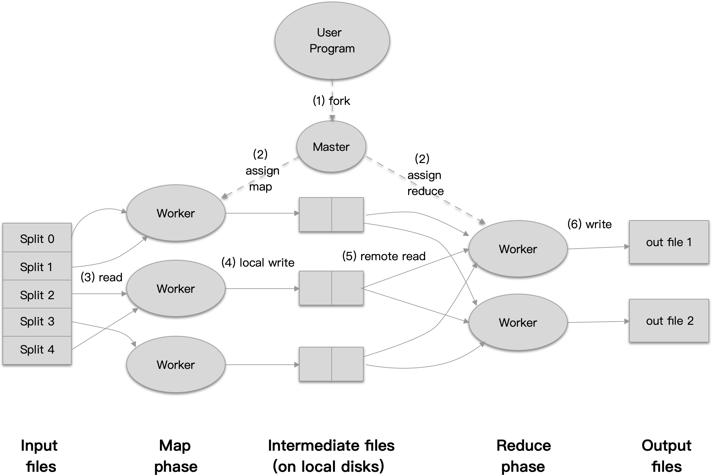

## MapReduce: 以简易的方式在庞大集群中处理数据

[TOC]


## 摘要 Abstract
`MapReduce` 是一个用来处理或生成大型数据集的编程模型的具体实现. 用户通过 `map` 函数对 *键值对* 的输入进行处理，从而产生一系列的中间 *键值对*, 然后 `reduce` 函数合并所有 *键* 相同的 *值*. 许多现实中的任务都能够使用这个模型来表达，就像我们将在本论文中介绍的。

使用这个函数式风格实现的函数，能够在一个使用普通商业计算机的集群中，自动的并行执行. 运行时会对输入的数据进行分区、调度到集群中的机器中运行，并处理机器的机及机器之间的通信问题. 这能够使程序员在不具有 *并行化* 或 *分布式系统*的经验时，也能够非常容易的将整个分布式系统的资源利用起来.

我们对 `MapReduce` 的实现能在使用普通商业计算机组成的庞大集群中运行且具有高度的可扩展性：一个典型的 `MapReduce` 计算能够在数以千计的机器上处理巨大的数据量。程序员们也会发现整个系统是如此的易于使用：每天都会有数以百计的 `MapReduce` 程序被实现并转换为上千个 `MapReduce` 的任务在 `Google` 的集群中运行。

## 1. 介绍 Introduction

在过去的五年中，包括作者在内的许多谷歌的员工为了各种目的实现了数以百计的程序用来处理大量的原始数据，比如处理网页的爬虫、页面请求日志等，为了处理各种不同类型及来源的数据，比如倒排索引、各种网页的图结构的表示方式，每个站点中各个页面的概要等，以及每天都最频繁执行的查询。这些任务中的大部分都是比较简单的。但是，因为这些计算所需输入的数据往往都是非常巨大的，所以程序必须能够分布在数以百计或千计的机器上去运行，才能够在可接受的时间内完成。问题在于，让程序能够并行化，让数据分布到各个机器上以及处理分布任务的失效等，比原本需要实现的计算逻辑更为复杂。

为了应对这个难题，我们设计了一个允许我们表达原本简单的计算，同时隐藏背后复杂的并行化、容错、数据分布及负载均衡的新的抽象。这个抽象是从 `Lisp` 及类似的函数式编程语言中的 `map` 及 `reduce` 模型启发而来的。我们发现大部分的计算都类似于通过将逻辑上的 `记录` 作为 `map` 操作的输入，然后产生一个中间态的 `key/value` 集合，然后将集合中所有 `key` 相同的记录作为同一个 `reduce` 操作的参数，最终能够合理的将这些数据聚合起来。将用户实现的 `map` 跟 `reduce` 操作应用到这个函数式模型中，允许我们可以很简单的将计算并行化，并使用函数的可重入性作为基础机制来支持容错。

我们以上设计的提供了简单且强大的接口，让我们能够自动的并行化及得到可扩展的分布式计算能力，结合这个接口的实现使我们得到了能够高性能的运行在普通商业计算机集群上。

第二节将介绍基础的编程模型并提供几个实例；第三节将介绍一个`MapReduce` 的实现能够适配我们现有的集群计算环境；第四节将介绍几个我们精炼出来的有用的编程模型。第五节则是确认了我们的实现在各种多样化的任务中的性能；第六节介绍了在 Google 中使用 `MapReduce` 的经验，其中包括了重写产品级的索引系统；第七节讨论了一些相关及未来的工作。


## 2. 编程模型 Programming Model

计算任务会获取一个 `Key/Value` 的键值对集合，然后产生一个 `Key/Value` 的键值对集合作为输出。而 `MapReduce` 库的用户则负责将计算任务表达为两个函数： `Map` 及 `Reduce`。

`Map` 是由用户实现的一个接收一个键值对并输出一个中间态的键值对的函数。`MapReduce` 库则将这些中间态的值通过相同的 `Key` 进行关联及分组，并传递给下一步的 `Reduce` 函数。

`Reduce` 函数一样是由用户实现，接收一个来自中间态的 `Key`，及一个由该 `Key` 组合得到的 `Value` 集合。他负责合并这些 `Value` 为一个更小的结果集合。典型的场景是每个 `Reduce` 的调用会产生 0 或 1 个输出。从中间态得到的 `Value` 集合通过迭代器的方式传递给用户实现的 `Reduce` 函数，这种方式使我们能够处理大于内存的数据。

### 2.1 示例 Example

考虑一个问题，为统计一大批的文档集合中，各个词出现的次数。用户可能会实现类似下面的伪代码：

```java
map(String key, String value):
	// key: document name
	// value: document contents
  for each word w in value:
    EmitIntermediate(w, "1")
      
reduce(String key, Iterator values):
	// key: a word
	// values: a list of counts
	int result = 0;
	for each v in values:
    result += ParseInt(v);
	Emit(AsString(result))
```

`Map` 函数将每个词作为 key，及将其关联的统计数（即是 example 中的 "1"）通过 `EmitItermediate` 提交出来。而 `Reduce` 函数则计算所有词的个数总和，并将总和与该词一起通过 `Emit` 提交。

除此之外，用户写的代码去填充 `MapReduce` 规则对象中定义中，输入文件、输出文件一些其他的参数。然后用户将规则对象作为参数开始启动 `MapReduce` 函数，这个时候，用户实现的代码将会跟由 `C++` 实现的 `MapReduce` 库进行链接。附录 A 包含该实例的完整代码。

### 2.2 类型 Types

尽管上一小节的伪代码是用字符串来描述输入跟输出，概念上，`Map` 跟 `Reduce` 函数提供给用户的是关联的数据类型：

```
map    (k1, v1)				 -> list(k2, v2)
reduce (k2, list(v2))  -> list(v2)
```

举例来说，输入的 `Keys` 跟 `Values` 是被描绘成跟输出的的 `Keys` 跟 `Values` 不同的领域，并且，中间态的 `Keys` 跟 `Values` 跟输出的 `Keys` 跟 `Values` 则是相同领域的。

我们的 `C++` 实现传递了 `String` 给用户实现的函数，并且将类型转换等工作交给了用户自己去实现。

### 2.3 更多示例 More Examples

下面这些有趣的小程序可以轻易地用 `MapReduce` 的计算来表示。

**Distributed Grep**: `Map` 函数提交每一个符合指定模式的行，而 `Reduce` 函数则只是简单的将中间态的数据作为最终输出。

**Count of URL Access Frequency**: `Map` 函数处理页面的请求日志，然后输出如 (URL, 1) 。`Reduce` 函数则将输入的所有相同 URL 的 `Values` 统计起来，然后输入 （URL, total count) 的键值对。

**Reverse Web-Link Graph**: `Map` 函数输出由 `Target`, `Source` 组成的键值对，表示每个在 `Source` 页面找到的链接 `Target`。`Reduce` 函数连接每个 `Target` 对应的 `Source` 到列表中，从而得到所有链接到 `Target` 的 `Source` 页面，并用如下形式表示 `(Target, list(Source))`。

**Term-Vector per Host**: 词向量以 `(Word, Frequency)`键值对的形式总结了一篇文档或一系列文档中最重要的词语。`Map` 为每篇输入的文档函数提交 `(Hostname, Term Vertor)`形式的键值对，其中的 `Host` 是从文档的 Url 解析得到的。`Reduce` 函数则以 `Host` 为键，将每篇文档的词向量叠加起来，并丢弃那些少见或价值不高的词，最终输出以 `(Hostname, Term Vector)` 形式的键值对。

**Inverted Index**: `Map`函数解析文档信息，并提交一系列的 `(Word, Document ID)` 键值对。`Reduce` 函数接收所有指定词的键值对，根据文档的 `ID` 排序后，提交以 `Word` 为 `Key` 以 `Document ID` 列表为 `Value` 的键值对列表 `(Word, list(Document ID))` 集合。这个输出的键值对集合组成了一个简单的倒排索引，可以使用它来定位每个词所在的文档。

**Distributed Sort**: `Map` 函数提前每条记录的 `Key`, 并以 `(Key, Record)` 的记录提交。`Reduce` 函数则原封不动的提交接收到的键值对。这个计算依赖于在 4.1 节讨论的分区机制及在 4.2 节提到的排序特性。


## 3. 实现 Implement

按照 `MapReduce` 的接口来提供各种不同的实现是可行的，但是否正确的选择则取决于当时的环境。举例来说，一种实现可能很适合小型的共享内存的机器，另一种可能适合 `NUMA` 多处理器的机器，还有一种适合大量的通过网络连接的机器集群。

在这一节将描述一种在 Google 内部用的非常广泛的实现，他所使用的环境是：以普通商用计算机通过以太网连接起来的庞大集群。在这个环境中：

1. 使用常见的 X86 双核，2-4 GB 内存且运行着 Linux 系统的机器
2. 普通的商用网络硬件，常见的是 100 M/S 及 1 G/S 的级别，但是其平均的速率在这两者之间。
3. 一个包含了上百或上千台机器的集群，因此机器的失效也是常见的。
4. 每台机器上都安装了普通的 IDE 硬盘，内部开发的分布式文件系统则用来管理这些硬盘中的数据，这个文件系统使用 Replication 的方式为这些不安全的硬件来提供高可用性及可靠性。
5. 用户提交任务到分布式系统，每个任务由一系列的 Task 组成，这个任务由调度器安排到集群中的一系列机器中运行。

### 3.1 运行概览 Execution Overview





`Map` 阶段自动的将输入数据分成 M 个分区，并发布到多台机器上，分块后的数据能够并行的在不同的机器上处理。`Reduce` 阶段则将使用中间态的 Key 集合按照分区函数分成 R 个实例（如使用 `hash(key) mod R` 的方式），分区数 R 及分区函数由用户提供。

附图 1 展示了我们实现的 `MapReduce` 版本的总体流程，当一个用户的程序调用了 `MapReduce` 函数，就会触发下列列出的一系列操作（下面操作的序号与附图中的序号是相符的）：

1. `MapRecude` 库首先将输入数据分成 M 份，每份数据在 16到 64 MB 之间，（这取决于用户所传递的参数信息），然后在集群的机器中启动该程序的多个副本。
2. 其中称为 `Master` 的副本是特殊的，其他的 `Worker` 副本则是执行 `Master` 分配的任务。在这里将会有 M 跟 `Map` 任务及 R 个 `Reduce` 任务将会被分配。`Master` 为空闲的 `Worker` 分配 `Map` 或 `Reduce` 任务。
3. 一个被分配到 `Map` 任务的 `Worker` 将读取与其任务相关的数据块，并将数据解析成对应的键值对，然后传递给用户定义的 `Map` 函数，然后由 `Map` 函数产生的键值对信息则被缓存在内存中。
4. 这些缓存文件，将周期性的被写回磁盘，并按照分区函数被分为 R 份。这些被写回磁盘的文件路径信息将传递回 `Master` ，由它负责管理并将这些路径信息发送给负责  `Reduce` 任务的副本。
5. 一个被分配到 `Reduce` 任务的副本会从 `Master` 获取到对应的路径信息，然后通过远程过程调用(RPC) 的方式从 `Map` 副本的机器中读取数据。当 `Reduce` 副本读取到完整的中间态数据后，他将按照中间态的 `Key`s  进行排序，然后得到数据按照 `Key` 进行分组的结果。排序这部分是必须的，因为通常情况下很多不同的 `Key` 会映射到同一个 `Reduce` 任务。当中间态的数据比内存更大时，将使用外部排序算法。
6. `Reduce` 副本迭代已排序的中间态数据并预期每个分组的数据都有唯一的 `Key`，然后他将 `Key` 及其对应的数据传递给用户实现的 `Reduce` 函数。`Reduce` 函数输出的数据将通过附加的方式输出到文件。
7. 当所有的 `Map` 及 `Reduce` 任务都完成了，`Master` 将唤醒用户的程序，这时 `MapReduce` 调用将从用户的代码返回。

在任务成功执行之后，`MapReduce` 的输出被分成了 R 个文件（每个 `Recuce` 任务一个，名称规则则由用户提供），常见情况下，用户无需自己将这 R 个文件合并成一个，他们通常会被作为其他 `MapReduce` 任务输入文件，或是通过其他的能够处理多个文件分布式程序来使用它们。

### 3.2 Master Data Structures

`Master` 副本维护着许多的数据结构，如每个 `Map` 及 `Task` 任务的状态(idle, in-progress, completed)，及每个 `Worker` 副本的标识。

`Master` 还充当着在 `Map` 任务及 `Reduce` 任务中传递中间态文件信息的管道。因此 `Master` 需要维护 R 个，由 `Map` 任务输出的文件路径及尺寸的中间态文件的信息。这些文件的信息会在每个 `Map` 任务完成的时候更新。这些信息将会被增量的推送给那些 `in-progress` (处理中) 状态的 `Reduce` 任务。

### 3.3 容错 Fault Tolerance

`MapReduce` 库就是为了帮助人们在成百上千的机器上处理大批量的数据，所以它必须能够优雅的处理机器的失效问题。

#### Worker Failure

`Master` 会周期性的 `Ping` 每个 `Worker` 副本。如果在指定的时间内没有收到回复，`Master` 会将其设置为 `failed` 失效。当一个 `Worker` 副本完成他手上的 `Map` 任务时，会将其自身的状态设置回 `idle`，这样他就能继续接受调度去执行其他的任务了。类似的，如果一个 `Map` 或 `Reduce` 任务执行失败了，当前的 `Worker` 也会设置自身为 `idle` 状态以接受新的调度。

当一个 `Worker` 失效时，他的 `Map` 任务失败后会会重新调度运行，因为他原本的输出是在 `Worker` 本地的磁盘上，所以失败时那些输出已经无法再次访问了。一个 `Reduce` 任务则无需重新执行，因为他的输出是保存到全局的文件系统中的。

当一个 `Map` 任务首次执行在 `Worker` A 副本上，然后接着在 `Worker` B 副本上执行时（因为 A 失效了）， 所有负责 `Reduce` 任务的 `Worker` 副本会接收到他在 `Worker` B 上重新执行的通知，这样 `Reduce` 任务就不会尝试从 `Worker` A 中读取数据，而是会尝试从 `Worker` B 中读取。

`MapReduce` 能够应付大批量的 `Worker` 节点失效的情形。比如当前正在处理一个 `MapReduce` 工作，集群的网络出问题导致 80 台机器在数分钟内无法连通。`MapReduce` 的 `Master` 通过重运行那些原本运行在失效节点上的任务，使进度能够继续推进，最终完成整个 `MapReduce` 工作，

#### Master Failure

可以通过让 `Master` 周期性的将我们上文中提到的数据结构保存为检查点。如果 `Master` 节点失效了，新的副本能够通过最新的检查点来恢复状态。然而，因为只有一个 `Master` 节点，它的失效是非常罕见的。因此我们现在的实现中会在 `Master` 节点失效时终端整个 `MapReduce` 的执行。客户端可以在需要的时候自己来检查并且重新尝试运行这个 `MapReduce` 工作。

#### Semantics in the Presence of Failures

当用户提供的 `Map` 及 `Reduce` 操作对于输入的参数是具有确定性的*（即函数的输出只跟输入的参数有关，类似纯函数）*，我们的分布式实现能够产生与程序在没有出错时顺序执行时同样的输出*（也就是分布式运行的结果能够保持跟顺序执行的结果一致）*。

我们依赖于对 `Map` 跟 `Reduce` 输出的原子性的提交来达到这个目标。每个执行中的任务都将它的输出写入到私有的临时文件中。 `Reduce` 任务产生一个这样的文件，`Map` 任务则产生 R 个这样的文件（为每个 `Reduce`产生一个）。当一个 `Map` 任务完成时，`Worker` 节点会发送消息通知 `Master` 节点，这个消息中就会包含这 R 个临时文件的名称。如果 `Master` 节点收到已通知过的任务完成消息，他会忽略这个消息。否则的话他就将这 R 个文件的名称信息保存到他自己的数据结构中。

当 `Reduce` 任务完成时，运行该任务的 `Worker` 节点会自动的将临时文件重命名为最终的数据文件。如果一个相同的任务同时在多个机器上执行了，会在最终的输出文件上产生多次重命名调用。我们依赖于底层文件系统的原子性的重命名操作来保证最终的输出文件只会被一个 `Reduce` 任务执行重命名一次。

大部分的 `Map` 跟 `Reduce` 操作是具有确定性的，所以我们提供了跟顺序执行具有相同的语义，因此这让开发人员能够很容易的来解释或定义程序的行为。当 `Map` 与/或 `Reduce` 是不具有确定性的，我们提供了稍弱一些但仍然合理的语义，对于非确定性的操作来说，一个 `Reduce` 任务  R~1~ 的输出跟按照顺序执行的输出是等价的。==然而，对于另一个不同的 `Reduce` 任务的R~2~ 可能会符合 R~2~ 使用不同的顺序执行的输出。??==

考虑有 `Map` 任务 M 跟 `Reduce` 任务 R~1~ 跟 R~2~ 。让 e(R~i~) 表示 R~i~ 的一次提交。这是会出现较弱的语义因为 e(R~1~) 可能会读到 M 的某次执行输出，而 e(R~2~) 可能会读到 M 的另外一次执行输出。

### 3.4 本地化 Locality

网络带宽在我们的计算环境中是相对缺乏的。我们会通过一个事实来尝试节约带宽，那就是我们的输入数据是使用 GFS 保存在集群的本地的磁盘上的。GFC 会将每个文件分割成 64MB 的块并在不同的机器上保存数个副本（通常是 3 个）。而`MapReduce` 的 `Master` 则根据每个输入文件每个块在集群中的分布信息尝试在拥有相关文件块的机器上调度 `Map` 任务。当没法实现的时候，则尝试在拥有相关文件块机器的邻近机器上调度 `Map` 任务（比如处于相同网络交换机的机器），在运行一个大型的 `MapReduce` 任务时，这是对于集群中的 `Worker` 节点来说是一个重要的优化，大部分的输入数据都能够在本地读取，从而无需耗费网络带宽。

### 3.5 任务粒度 Task Granularity

如前面所说的，我们将 `Map` 阶段分割为 M 个，将 `Reduce` 阶段分割为 R 个。理想情况下， M 跟 R 应该远大于 `Worker` 节点的数量。每个 `Worker` 节点处理多个任务能动态的提升负载均衡，也能够加快 `Worker` 失效时的恢复速度：大部分的 `Map` 任务能够分布到集群所有 `Worker` 节点中去完成。

这里对于 M 跟 R 实际的大小在我们的实现里有着实际的界限。`Master` 节点需要做 O(M+R) 次调度抉择，及在内存中保存 O(M \* R) 个状态信息。（当然，这个常数因子对内存的消耗是非常小的，在 O(M \* R) 中的每一个 Map/Reduce 任务的键值对只需消耗大约一个字节）

而且R 常常是由用户进行限制的，因为每个 Reduce 的最终输出都是一个独立的文件。实际上，我们趋向于根据让每个单独的任务接收 16MB 到 64MB 的输入的原则来定义 M（这样我们在上一届所提的本地化优化，就能发挥他的作用了），然后我们把 R 定义为 所期望 `Reduce` 在多少个 `Worker` 节点上运行的数目乘以一个较小的常数。在期望使用 2,000 个 `Worker` 个节点时，我们常常定义 M = 200,000 及 R = 5,000。

#### 3.6 后备任务 Backup Tasks

掉队者(Straggler) 是一个常见的会放大整个 `MapReduce` 操作运行时长的因素：在整个计算过程中，有一些机器耗费了比寻常更长的时长去执行他的 `Map` 或 `Reduce` 任务。掉队者可能因为许多的原因出现。比如一个磁盘损坏了的机器会导致他的读取性能从 30 MB/s 下降到 1 MB/s。集群中的调度器或调度其他的任务在同一个机器上执行，造成 CPU，内存，磁盘 或网络带宽的竞争。一个我们最近遇到的问题是机器的初始化代码配置错误导致处理器缓存被禁用：在受影响的机器上的计算效率下降了超过一百倍。

我们使用了一个通用的机制来缓解掉队者问题。当一个 `MapReduce` 整体接近完成时，`Master` 节点会为那些还在运行中的任务启动后备任务。这些任务会在他的主任务或后备任务完成时被标记为完成。我们还对这个机制进行了些调整来保证他不会占用整个集群的太多计算资源（几个百分点）。最后我们发现它显著的减少了一些大型 `MapReduce` 任务的时间。比如我们将在 5.3 节介绍的 `Sort` 程序，在禁用该机制的情况下他多耗费了 44% 的时间。

## 4. 精炼 Refinements

尽管使用基础的 `Map` 跟 `Reduce` 函数已经能够满足大部分的需求，但我们发现有一些扩展支持是非常有用的，在这一节将介绍它们。

### 4.1 分区函数 Patitioning Function

用户的 `MapReduce` 任务提供了他们希望 `Reduce` 函数输出的文件数 R。数据通过分区函数对中间态数据的 Key 进行分区后传递到 `Reduce` 函数中。默认提供的分区函数使用了哈希的方式 *(如 `hash(key) mod R`)*，这使数据能够均衡分布的输出到各分区。在某些场景中，能够使用其他的分区函数可能会更好，比如最终输出的 `Key` 是 `URL`，我们希望同一个站点的链接最终能够集中在同一个输出文件中。为了支持类似这样的场景，我们允许用户提供一个自定义的 分区函数。比如使用 `hash(Hostname(urlkey)) mod R`  作为分区函数就能够保证同一个站点的数据能够输出到同一个文件中。

### 4.2 顺序保证 Ordering Guarantees

在给定的一个分区中，中间态的键值对数据能够确保以升序的方式进行处理。这个保证让每个分区生成一个有序的最终结果集变得更加简易。这在用户需要对最终输出文件进行随机访问或要求数据有序的情况下是非常有用的。

### 4.3 合并函数 Combiner Function

在某些情况下，一些由 `Map` 任务产生的中间态的 Key 存在着很明显的重复，且用户提供的 `Reduce` 函数是可交换且与其相关的。一个较好的例子就是在 2.1 节介绍的单词统计的例子。如果单词的出现的频率遵循 `Zipf` 分布，那每个 `Map` 任务都会产生成百上千的类似 `(the, 1)` 键值对的记录。这些记录将通过网络发送到 `Reduce` 函数来产生一个总值。我们允许用户提供一个可选的`合并`函数，在数据被通过网络发送出去之前进行合并。

这个 `合并` 函数在每个运行了 `Map` 任务的机器上执行。常见的情况是 `合并` 函数的实现跟 `Reduce` 函数是几乎一样的。他们之间的唯一区别是 `MapReduce` 库对他们输出结果的处理方式。`Reduce` 函数的输入结果被写到最终的输出文件中。`合并` 函数的输出结果则被写到中间态的文件中，然后被发送到 `Reduce` 任务中去。

部分的合并显著的提升了 `MapReduce` 操作的性能，附录中提供了使用 `合并`函数的例子。

### 4.4 输入与输出的类型 Input and Output Types

`MapReduce` 库提供了读取不同类型的输入文件的支持，比如 `文本` 类型的输入将每行数据当成一个键值对：`Key` 是该文件的偏移量， `Value`则是每一行的内容。另一种常见的支持格式类型则是按照 Key 排序的一系列的键值对。每种输入类型的实现知道如何按区间切分数据为一系列有意义的 `Map` 任务（如文本模式则以行为区间来分割数据）。用户可以通过实现 `reader` 接口来为一些新的输入类型增加支持，尽管大部分的用户都只是使用少数的几个预定义输入类型。

一个 `reader` 的实现不一定非得从文件中读取数据，也可以很容易的实现一个从数据库中读取记录或从内存中的某些数据结构读取记录的 `reader`。

以同样的方式，我们提供了一系列的输出类型支持用于产生不同的数据，并且用户也能够轻易的添加一种新的输出类型。

### 4.5 副作用 Side-effects

有些情况下，`MapReduce` 的用户发现输出一些辅助文件便于他们后续的 `Map` 或 `Reduce` 操作。我们依赖于应用的 `Writer` 去保证这些副作用的操作具有原子性及幂等性。如 `Writer` 将输出写到临时文件并在完成整个输出后，原子性的重命名这个临时文件到最终文件来。

我们并不提供这种在单个任务中产生多个输出文件的类似原子二阶段提交的支持。因此对于这种会产生多个输出文件且文件间有一致性要求的任务，都必须具有确定性。这个限制在实践中还没产生过什么问题。

### 4.6 忽略错误记录 Skipping Bad Records

有时用户提供的 `Map` 或 `Reduce` 函数可能存在 Bug， 导致在处理某些记录时会让程序崩溃。这些 Bug 会导致程序无法完成。通常的做法是去修复这些 Bug，但有些时候这不一定可行：也许这个 Bug 来自于一些我们无法触及源码的第三方库。而且，忽略某些出错的记录也是一个可以接受的选择，比如在对一个大数据集进行统计分析。由此我们体统了一个可选的模式，用于在 `MapReduce` 库执行时检测那些必然会导致程序崩溃的记录，在遇到这些记录时选择忽略他们，从而让程序能够正常完成。

每个 `Worker` 进程都会使用信号来处理程序的段错误及总线错误信息。在执行 `Map` 或 `Reduce` 操作前，`MapRecude` 库会在全局变量中保存当前正在处理函数的序号。如果用户的代码触发了对应的信号，该进程会通过 UPD 发送一个包含了当前序号的消息给 `Master` 副本。当`Master`副本收到有节点因为这条记录失败的了超过一次，在下一次运行这一趟任务时，他将该条记录标识为应当忽略的信息一并发送给 `Map` 或 `Reduce` 任务。

### 4.7 本地执行 Local Execution

对 `Map` 或者 `Reduce` 函数进行调试可能会比较困难，因为他们实际运行在一个可能具有数千台机器的分布式系统上，而且具体运行在哪个机器还得依照 `Master` 副本的调度来决定。为了提高调试、性能测试及小规模扩展的测试，我们开发了 `MapReduce` 的另一个实现版本：他们只会在本地机器上顺序的运行每个任务。对任务流的控制则归还给了用户，可以把它当成一个普通的 `Map` 任务。用户在启动程序时只需要提供一个特殊的标识，这样他们就可以在 `MapReduce` 中进行他们常用的调试或测试了。

### 4.8 状态信息 Status Information

`Master` 节点同时还运行着一个 HTTP 服务，用来提供一些用户可读的信息页面。这些信息页面提供了整个计算的进度信息，比如有哪些任务已经完成了，有哪些任务正在运行，输入了多少字节数，中间态的数据占了多少字节，输出了多少字节数，处理速度等等。这些页面还包含连接到每个任务的标准输出跟标准错误输出文件的链接。用户可以使用这些数据来推测任务大概会花费多少时间，需不需要为计算添加更多的资源。这些信息同样还能用来分析任务的性能在什么情况下会运行的比预估的慢。

还有，最顶层的状态信息页还展示了哪些 `Worker` 失效了，以及他们失效时正在运行哪些 `Map` 或 `Reduce` 任务。这些信息对于我们用来分析程序的 Bug 来说是非常有用的。

### 4.9 计数器 Counters

`MapReduce` 库还提供了帮助我们用于统计一些事件信息的计数器支持。比如，用户的代码可能想要统计一共处理了多少个词，或索引了多少篇德文的文档。

用户代码通过创建一个命名的计数器对象来使用这个机制，并可以在用户实现的 `Map` 或 `Reduce` 函数中去递增这些计数器。看个例子：

```cpp
Counter* uppercase;
uppercase = GetCounter("uppercase");

map(String name, String contents):
	for each word w in contents:
		if (IsCapitalized(w)):
			uppercase->Increment();
		EmitIntermediate(w, "1");
```

这些运行在 `Worker` 节点上的计数器的值，会周期性的提交给 `Master` 节点（通过附加在对 `Master` Ping 检查的响应中）。`Master` 节点则统计这些来自成功运行的 `Map` 或 `Reduce` 任务计数器，并在最后计算完成时将统计的信息返回给用户。当前的计数器值同样会在 状态信息页面上展示，用于让人可以通过计数器的值来得到执行进度。在统计计数器的值时，`Master` 节点会检查计数器的值是否来自于重复执行的 `Map` 或 `Reduce` 任务，以防止重复统计（重复执行可能来自于备用任务机制或因为失败而重复执行的任务）。

`MapReduce` 库自身也会维护一些计数器，比如输入的键值对数目以及输出的键值对数目。

用户会发现计数器机制对于 `MapReduce` 任务的行为检查是非常有用的。比如，对于某些 `MapReduce` 操作，用户的代码可能想确认确认输出的键值对数目跟输入的键值对数目是否相等，或是计算德文相关的文档在整体文档中的比例。

## 5. 性能 Performance

在这一节中我们使用两个跑在庞大集群的计算任务来验证 `MapReduce` 的性能。其中一个在大约 1TB 的数据中查询一个常见的模式。另一个则是对大约 1TB 的数据进行排序。

这两个是从真实程序中挑选出的两个典型的 `MapReduce` 程序 -- 其中一个对数据进行重组为另一种数据；另一个程序从一个大量的数据集中提取出少量我们感兴趣的数据。

### 5.1 集群配置 Cluster Configuration

所有的程序都将运行在这个由大约 1800 台机器组成的集群中。其中每一台机器使用的配置都是：2GHz Inter Xeon Processos with Hyper Threaading, 4GB 的内存， 两块 160GB 的 IDE 硬盘，千兆的网卡。这些机器在一个树状的二级路由网路中，路由的顶部带宽大概为 100-200 Gbps。并且，它们都处于同一个网络中，所以每个机器之间的 往返延时(RTT round-trip time) 都少于 1 毫秒。

这 4GB 的内存中，有 1-1.5GB 将被其他的集群中的任务所使用。这些将要执行的任务都被安排在周末的下午，这个时间段中大部分的计算机资源，如 CPU，硬盘跟网络带宽都比较闲余。

### 5.2 查找 `Grep`

查找程序 `grep` 将会扫描 10^10^ 条 100Byte 大小的，符合三个指定特征模式的记录（大概有 92,337 条记录）。输入的文件分块尺寸为 64MB(M = 15000) 且最终输入的文件只有一个（R = 1）。

附图 2 展示了计算过程的时间曲线。Y 轴展示了某个时刻下对输入数据进行扫描的速率。速率则由于不断的将 `MapReduce` 计算分配给更多的机器而得到逐步的提高。在分配给了 1764 台机器的时候，整体的速率达到了 30GB 每秒。在 `Map` 任务完成后整体的速率则开始下降，并在 80 秒是趋近于零。最终整个任务从开始到完成花费了大约 150 秒。这其中包含了整个程序启动以及分发的开销所使用的 1 分钟，以及操作 GFS 去打开这 1000 个输入文件以及获取其相应的信息用来做本地化优化的开销。

### 5.3 排序 Sort

排序程序对 10^10^ 个 100 字节的记录进行排序。该程序以 TeraSort 的基准为模型。

该排序程序包含了不到 50 行的用户代码。包括了 3 行的 `Map` 函数，用来从输入的文本行中提取大小为 10 个字节的 Key, 及提价以该 Key 及文本行构成的键值对。我们使用了内建的 `Identity` 函数作为 `Reduce` 操作符。这个函数将中间态的键值对信息直接作为最终的输出。最终输出被写入到了一组双向复制的 GFS 文件中。（也就是最终输出的数据量为 2TB，因为输入为 1TB）

像之前提到的，输入的数据被分割成以 64MB 为块的文件（M = 15000）。然后将最终排好序的结果，以记录的 Key 作为分区函数的根据，输出到 4000 个文件中（R = 4000）。

我们在这个测试中的分区函数对数据的分布已经有了充足的认知。对于通常的排序程序，我们会增加一个预处理的 `MapReduce` 操作用来对数据的 Keys 的分布进行采样，并用采样的信息来决定最终输出的文件数。

附图3(a) 展示了排序程序正常执行结果。左上的图片展示了对输入数据的读取速率，这个速率在最高峰时达到了 13GB/s 并在所有的 `Map` 任务完成的 200 秒这个节点前已相当快的速度降下来。该读取的速率较之 查找 程序是慢的多的。这是因为排序的 `Map` 任务需要花费他们进一般的时间跟 I/O 带宽将数据写入到本地的中间态文件中。查找程序的中间态文件跟它比起来是几乎可忽略不计的。

中间的图片展示了数据由 `Map` 函数传递到 `Reduce` 函数的带宽速率。这个清洗的操作在第一个 `Map` 任务完成是就开始进行。图形中的第一个波峰来自于第一批 1700 个 `Reduce` 处理任务（整个 `MapReduce` 任务被分配给了 1700 台机器，每台机器最多只能运行一个 `Reduce` 任务。在接近 300 秒时第一批 `Reduce` 被完成，在第一批 `Reduce` 任务完成后会继续清洗剩余的 `Reduce` 任务。所有的清洗在 600 秒左右全部完成。

左下的图片则展示了 `Reduce` 任务将最终数据写入到磁盘的速率。我们发现在第一次清洗及第一次写入间是有延迟的 ，因为这时机器还在忙于对中间态的数据进行排序。写入持续维持在 2-4GB/s 一段时间，所有的写入则在 850 秒时完成。加上启动时的负载，整个任务花费了 891 秒，这个成绩跟当前最佳 1057 秒的 TeraSort 性能是比较接近的。

还有一些注意点：输入的速率高于清洗的速率及最终输出的速率是因为我们的本地化优化 -- 大部分的数据都是从本地磁盘读取，得以绕过相关的网络带宽限制。清洗的速率高于最终数据的速率是因为在输出步骤需要将已排序的数据写入两次文件系统（我们为最终的输出使用了两个副本用来保持高可靠性及可用性）。写两个副本是由底层使用的文件系统提供的高可用性的保障。如果底层的文件系统使用可靠的编码来替代使用副本的方式，也可以降低对网络带宽的消耗。


### 5.4 备用任务的效果 Effect of Backup Tasks

在附图 3(b) 中，我们展示了在排序程序中将备用任务机制禁用的结果。执行的整个流程跟附图 3(a) 非常接近，除了一点，在最后接近完成时，有非常长的拖尾任务，在 960 秒后，有 5 个 `Reduce` 任务未完成。然而这些掉队者在 300 秒后仍未完成。整个执行的耗时被延长到 1283 秒，比开启了备用任务机制时多花了 44% 的时间。

### 5.5 机器失效 Machine Failures

在附图 3(c) 中，我们展示了在排序程序过程中，在几分钟内杀掉了 1746 个 `Worker` 中的 200 个。集群中的调度器马上为我们在这些机器上又重启了新的 `Worker` 进程。（我们只是杀掉了这些进程，机器还是正常运行着的）。

`Worker` 进程被杀导致了输入的速率出现了负数，因为那些之前已经完成的 `Map` 任务消失了，所以其相关的任务需要被重新来完成。这些需要重新运行的 `Map` 任务在相对快的时间内被执行。整个计算过程，包括启动时的负载，最终在 933 秒时完成。（只是在正常运行的情况下增加了 %5 的运行时间）

## 5. 经验 Experience

我们在在 2003 年的 2 月实现了第一版的 `MapReduce` 库，然后再 2003 年的 8 月做了一些重要的强化，其中包括了本地化优化，认读在多个 `Worker` 运行中的动态负载均衡等。从那时起， `MapReduce` 对我们所在工作中能处理问题的能力带来了非常多的惊喜。他被用在了谷歌中的多个领域中，包括：

- 大规模的机器学习问题
- Google News 跟 Froogle 产品中的集群问题
- 为常见查询提取数据用来生成报表
- 为一些新的实验跟产品提供提取网页信息的能力。（如从全局的网页中提取地理位置信息用于本地化查询）
- 大规模的图运算


附图 4 展示了在我们的代码管理系统中 `MapReduce` 程序的增长曲线。从 2003 早期的 0 个到 2004 9 月的接近 900 个。`MapReduce` 得到了巨大的成功，因为他让我们可以在学习半个小时后就书写出简单的程序，并让这些程序高效的运行在有上千台机器上。大大的加速了具体开发和原型之间的循环。更重要的是，他让那些对分布式或者并行系统完全没经验的人们轻易的用上了我们的集群资源。

在最后，`MapReduce` 库记录分析了每个任务对计算资源的使用情况，在表格 1 中，我们统计了再 2004 年 8 月各个程序在使用的 `MpaReduce` 的情况。


### 6.1 大规模的索引 Large-Scale Indexing

`MapReduce` 一个最重要的使用是用它来完全重写产品级的索引系统，用于构建一些供谷歌的检索服务使用的数据结构。这个索引系统接收大量的储存于 GFS 的文档集合，这些文档集合来自于我们的采集系统。这些文档的原始文本的尺寸超过了 20TB。这个索引的过程需要 5 到 10 个 `MapReduce` 操作。使用 `MapReduce` （相对于之前的基于网络分发的分布式索引系统）带来了下面几点优点：

- 索引的代码更清晰、简洁跟易于理解，因为代码中那些错误处理、分布式及并行化的部分已经由 `MapReduce` 库处理了。比如其中一个步骤中的 3800 行 C++ 代码被使用 `MapReduce` 编写的 700 行代码代替了。
- `MapReduce` 库的性能已经足够好了，所以我们能将与概念上不相关的部分分隔开，而不是将他们混合在在一起来避免额外的数据传输。这让我们能够更容易的去更改索引的步骤。比如，在旧系统中一个更改可能需要花费数个月的时间，在新的实现中则只需要几天。
- 索引的处理也变得更加容易操作，因为大部分因为机器故障、机器缓慢及网络延迟等问题都被 `MapReduce` 库自动解决了。更进一步的是，可以简单的通过为索引程序添加机器来提升性能。

## 7. 相关工作 Related Work

很多的系统都提供了一种加以限制的编程模型，并通过该模型得以自动化的将程序并行化。==For example, an associative func- tion can be computed over all prefixes of an N element array in log N time on N processors using parallel prefix computations==。`MapReduce` 可以视为我们根据实际的经验对这些模型进行了简化的精华版。更重要的，我们实现了在上千个处理器中运行的容错机制，作为对比，大部分并行处理系统的实现只支持较小的规模，而且会将一些细节上的问题，如处理机器出错等问题交给开发人员去处理。

大部分的同步编程方法跟 MPI(跨语言通讯) 机制提供了较高层次的抽象来让开发人员能够较易的实现并行的代码。这些系统跟 `MapReduce` 显著的不同点就在于它提供了一个受限的编程模型用来自动将用户的代码并行化以及提供对用户来说透明的容错机制。

我们的本地化优化的设计灵感来自一些技术，如 `active disks`， 那些计算会被下推到靠近存储磁盘的处理元素那，从而节省了大量的 I/O 操作或网络传输。我们将程序运行在那些普通的直接连接硬盘设备的商业机器上，而不是直接运行在磁盘控制处理器上，不过大致上他们是一样的。

我们的后备任务机制跟 `Charlotte System` 的 `eager scheduling`  很像。其中一个 `eager scheduling` 的一个缺点是，当一个由他调度的任务不断的运行失败时，会导致整个运算都失效。我们则通过只是跳过错误记录的方式来修复这个缺点。

`MapReduce` 的排序机制跟 NOW-Sort 的操作非常像。源机器(运行 Map 任务的 Worker) 对数据进行分区及排序后发送给 R 个 Reduce Worker。每个 Reduce Worker  在本地对接收到的数据进行排序(如果内存允许则使用纯内存的方式)。当然 NOW-Sort 并没有那些让 `MapReduce` 中由用户定义的类似 Map 跟 Reduce 的函数，所以没法有很高的实用性。

`River` 提供了一个分布式队列，供程序间的信息传递。跟 `MapReduce` 类似， `River` 尝试提供一个平均性能优秀的方式去兼容多样的硬件或系统。`River` 通过小心的调度 磁盘 及 网络的传输来达到这个目标。`MapReduce` 使用了另一种方式，通过对编程模型加以限制，`MapReduce` 的 `Framework` 得以将任务拆分为大量的小粒度的任务。这些任务会被动态的调度在各个 `Worker` 中，所以越快速的机器能够处理约多的任务。这个受限的编程模型允许我们在程序的最后阶段通过冗余执行的方式来降低那些性能在平均性能以为的机器的计算时间。（比如机器较慢或被卡住的机器）

`BAD-FS` 提供了跟 `MapReduce` 差异非常大的编程模型，不像 `MapReduce`，他将任务执行在跨广域网的机器上，这里有两个基本的相似点：(1) 两个系统都使用冗余执行来恢复失效的任务中丢失的数据。(2) 两个系统都使用了本地化调度来减少数据在网络中的传输。

`TACC` 是一个被设计来构建高可用网络服务的系统。类似 `MapReduce`，他使用了重复执行的的机制来实现容错。


## 8. 总结 Conclusions 

`MapReduce` 的编程模型已经成功的在 Google 的各个不同场景中得到应用。我们将它的成功归结于几个原因。第一，就算是对于没有并行跟分布式系统经验的程序员来说这个编程模型也是易于使用的，因为他将并行的细节、错误处理、本地化优化跟负载均衡都隐藏在库的背后。第二，大型复杂的问题也很容易用 `MapReduce` 的模型来表达。比如用 `MapReduce` 来生成 Google 的检索服务所需使用的数据结构，排序数据，数据挖掘，机器学习以及其他各种系统等。第三，我们实现的 `MapReduce` 能够在由上千台机器组成的集群规模中运行。这个实现能够高效的使用这些机器资源，从而可以处理各种在 Google 中所需的大型计算问题。

我们还在这个实现中学习到了许多的东西。第一，加以限制的编程模型让并行化跟分布式计算以及容错更加易于实现。第二，网络带宽是稀缺资源，一些优化措施让我们能够显著的减少在网络中传输的数据：本地化优化让我们尽量从本地磁盘读取输入数据，及将中间态数据写入到本地磁盘，以实现节省带宽。第三，裁减的过慢的任务能用来减少一些过慢的机器及机器故障跟数据丢失的带来的问题。